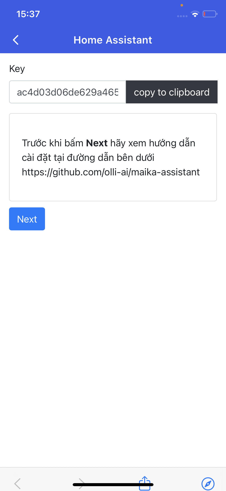

# maika-assistant

[](https://olli.vn)

# Installation instructions

- Copy thư mục `custom_components/maika_assistant` vào `<your config dir>/custom_components/maika_assistant`

```
<config directory>/
|-- custom_components/
|   |-- maika_assistant/
|       |-- __init__.py
|       |-- connection.py
|       |-- const.py
|       |-- manifest.json
|       |-- etc...
```

- Restart Home Assistant để cập nhật component maika_assistant
- Mở app Maika chọn tính năng smart home và thực hiện account linking: `Quản lý tài khoản liên kết` -> `Kết Nối Tài Khoản Mới`-> trong mục `Chọn nhà cung cấp`, chọn `Home Assistant`

  

- Trước khi bấm nút `Next` vui lòng copy key như hình trên và chép vào `api_key` trong file `configuration.yaml` như bên dưới, sau đó restart Home Assistant để cập nhật config

```yaml
maika_assistant:
  api_key: ac4d03d06de629a465a7fc53b7c1c734e04c3c729b3673e6326c0f354b49423771802938ad4191318d1f4df78a8990da
  report_state: true
```

# Configuration

- Component này được viết từ google_assistant component, tham khảo config từ google_assistant bạn có thể expose domain hoặc entity theo nhu cầu.
- https://www.home-assistant.io/integrations/google_assistant

```
# Example configuration.yaml entry
maika_assistant:
  api_key: YOUR_KEY
  report_state: true
  exposed_domains:
    - switch
    - light
  entity_config:
    switch.kitchen:
      name: CUSTOM_NAME_FOR_MAIKA_ASSISTANT
      aliases:
        - BRIGHT_LIGHTS
        - ENTRY_LIGHTS
    light.living_room:
      expose: false
      room: LIVING_ROOM
```

# License

This project is under the MIT license.

# reference

https://www.home-assistant.io/integrations/google_assistant
